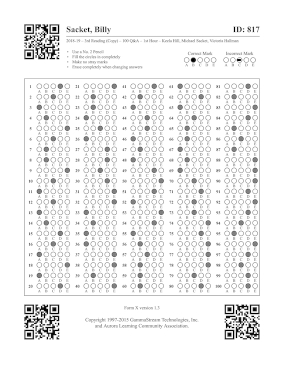

# QRCode Poly-reader

Finds multiple QR Codes in an image utilizing [jsQR][jsqr] under the hood.

## Why?

The main purpose of this poly-reader is find QR codes in multiple regions of a scanned document.



## Getting Started

To install, execute the following command from the root of your project:

```bash
npm install @gammastream/qrcode-poly-reader --save
```

Then, use it like this:

```ts
import * as fs from "fs-extra";
import * as UPNG from "upng-js";
import {polyReader} from '@gammastream/qrcode-poly-reader';


loadPng('./tests/artifacts/test-0.png').then((img) => {
    const results = polyReader(img.data, img.width, img.height);
    console.log( results );
});

async function loadPng(path) {
    const data = UPNG.decode(await fs.readFile(path));
    const out: {
      data: Uint8ClampedArray,
      width: number,
      height: number,
    } = {
      data: new Uint8ClampedArray(UPNG.toRGBA8(data)[0]),
      width: data.width,
      height: data.height,
    };
    return out;
  }
```

----

#### Created by


[**_GAMMASTREAM_**][gammastream]


[gammastream]: http://www.gammastream.com
[jsqr]: https://github.com/cozmo/jsQR